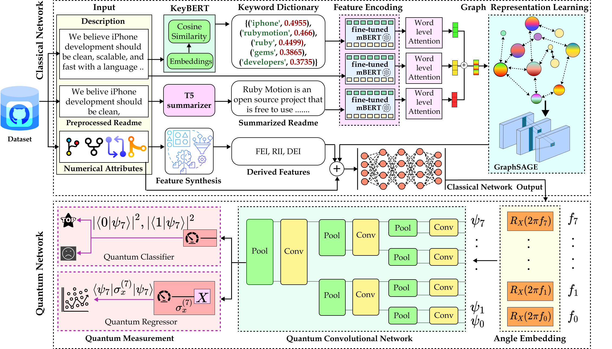

# QGNNPoP

This is the official code for project "Quantum-enhanced Deep Neural Network with Cross-Repository Graph and Feature Synthesis for Predicting Popularity in GitHub"

## Overview

In order to infer GitHub repository popularity, we suggest a novel hybrid classical-quantum neural network dubbed QGNNPoP, which combines cross-repository interactions, content-based and numerical variables, and quantum predictors. Our method starts by employing optimised transformers to extract textual information from repository descriptions and condensed readme files. We build a cross-repository graph with nodes representing content-based attributes and edges weighted according to the relevance score of common keywords in order to capture semantic relatedness. We create composite numerical characteristics that explicitly quantify the connections between repository activity, user interaction, and project visibility by linearly altering preexisting numerical features. The popularity of the repository is then estimated by processing the revised repository representations along with the original and derived numerical features using predictors inspired by quantum neural networks.

## Project Structure

The project is organized into different folders, each containing notebooks that cater specific aspects of the pipeline.

The dataset used is available here: https://github.com/Doodies/Github-Stars-Predictor/blob/master/dataset/data.csv

It requires python version 3.10.13.

